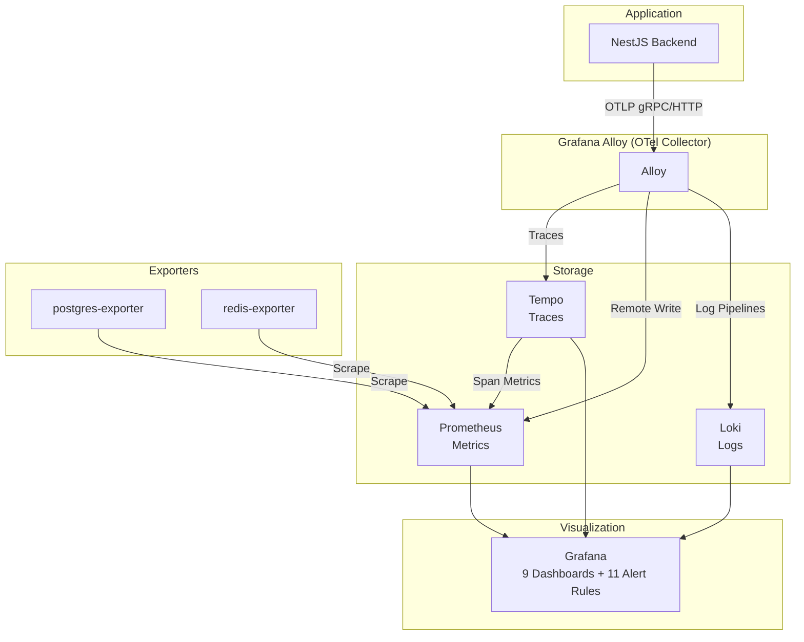

# Observability Stack

Production-ready observability platform built on the **Grafana LGTM stack** (Loki, Grafana, Tempo, Prometheus) with both local Docker Compose development and **AWS ECS Fargate** deployment via CloudFormation.

Features **9 pre-built Grafana dashboards**, **11 Prometheus alert rules**, **OpenTelemetry instrumentation** via Grafana Alloy, and a **start/stop cost-control Lambda** for non-production environments.

## Architecture



**Data pipeline:**
- **Traces**: NestJS -> OTLP -> Alloy -> Tempo (span metrics -> Prometheus)
- **Metrics**: NestJS -> OTLP -> Alloy -> Prometheus remote_write + Scrape targets (pg, redis, alloy)
- **Logs**: Docker containers -> Alloy -> Loki + NestJS -> OTLP -> Alloy -> Loki

## Quick Start (Local Development)

```bash
# 1. Configure environment
cp .env.example .env
# Edit .env with your database and Redis connection strings

# 2. Start the stack
./scripts/monitoring.sh start

# 3. Access services
#    Grafana:     http://localhost:3333  (admin/admin)
#    Prometheus:  http://localhost:9090
#    Alloy UI:    http://localhost:12345
#    Loki API:    http://localhost:3200
#    Tempo API:   http://localhost:3201
#    Netdata:     http://localhost:19999

# 4. Point your NestJS backend to send OTLP telemetry
export OTEL_EXPORTER_OTLP_ENDPOINT=http://localhost:4318
```

### Helper Script

```bash
./scripts/monitoring.sh start       # Start all services
./scripts/monitoring.sh stop        # Stop all services
./scripts/monitoring.sh restart     # Restart all services
./scripts/monitoring.sh status      # Show container status
./scripts/monitoring.sh logs        # Follow all logs
./scripts/monitoring.sh logs tempo  # Follow logs for a specific service
./scripts/monitoring.sh clean       # Stop and delete all data (volumes)
```

## AWS Deployment (ECS Fargate)

The stack is deployed to AWS ECS Fargate using CloudFormation nested stacks.

### Prerequisites

- AWS CLI configured with appropriate credentials
- ECR repositories created (the deploy script handles this)
- Target ECS cluster running (default: `my-cluster`)

### Deploy

```bash
cd aws/

make build          # Build and push Docker images to ECR
make deploy         # Deploy/update the full CloudFormation stack

make monitoring-start   # Start monitoring (desired_count=1)
make monitoring-stop    # Stop monitoring (desired_count=0, ~$1.55/mo storage only)
make monitoring-status  # Check running status

make monitoring-logs    # Tail ECS task logs
make destroy            # Delete entire stack (requires confirmation)
```

### AWS Infrastructure

| Resource | Purpose |
|----------|---------|
| ECS Fargate Service | Runs all 6 containers as a single task |
| EFS | Persistent storage for Grafana, Prometheus, Loki, Tempo |
| ALB + ACM | HTTPS termination at `monitoring.dev.example.com` |
| CloudWatch Logs | ECS container logs |
| IAM Roles | Task execution and AMP remote write |

### Production URL

```
https://monitoring.dev.example.com
```

## Dashboards

9 pre-built dashboards:

### API & Performance

| Dashboard | Description |
|-----------|-------------|
| **API Overview (RED Method)** | Request rate, error rate, latency percentiles, availability %, endpoint performance table with inline gauges, latency heatmap |
| **Traces & Service Map** | Service dependency graph, span metrics RED table, latency heatmap, top slowest operations, endpoint health grid, TraceQL trace search |

### Business Metrics

| Dashboard | Description |
|-----------|-------------|
| **Business Metrics** | Orders, payments, coupons, WhatsApp messages, authentication, notifications |
| **Operations Overview** | Bird's eye view aggregating active deliveries, open tables, orders today, payment success rate |
| **Delivery, Cards & Operations** | Delivery sessions, driver tracking, Loyalty Card/RewardPass, table sessions, cash register, inventory movements |

### Infrastructure

| Dashboard | Description |
|-----------|-------------|
| **Infrastructure** | CPU, memory, disk, network, Node.js event loop, V8 heap, GC pauses |
| **Database** | PostgreSQL connections, transactions, tuple operations, cache hit ratio, table sizes, replication lag |
| **Redis** | Memory usage, connected clients, command throughput, keyspace hits/misses, evictions |

### Logs

| Dashboard | Description |
|-----------|-------------|
| **Application Logs** | CloudWatch log volume by level, errors/warnings by NestJS context, top error messages, log search |

## Stack Components

| Component | Version | Port | Purpose |
|-----------|---------|------|---------|
| Grafana | 12.4.0 | 3333 | Dashboards, alerting, explore |
| Prometheus | 3.9.1 | 9090 | Metrics storage, alerting rules |
| Loki | 3.6.1 | 3200 | Log aggregation |
| Tempo | 2.7.2 | 3201 | Distributed tracing |
| Alloy | 1.9.1 | 4317/4318/12345 | OTLP collector, Docker log scraper |
| Netdata | stable | 19999 | Host metrics (local only) |
| postgres-exporter | latest | 9187 | PostgreSQL metrics scraper |
| redis-exporter | latest | 9121 | Redis metrics scraper |

## Alert Rules

Pre-configured Prometheus alert rules in `prometheus/alert-rules.yml`:

| Alert | Condition | Severity |
|-------|-----------|----------|
| HighErrorRate | HTTP 5xx > 5% for 5min | critical |
| HighLatencyP95 | P95 > 2s for 5min | warning |
| HealthCheckFailing | Backend unreachable for 1min | critical |
| PaymentFailures | Payment failure rate > 10% for 5min | critical |
| WhatsAppDown | WhatsApp error rate > 50% for 5min | warning |
| HighMemoryUsage | Memory > 80% for 5min | warning |
| HighCPUUsage | CPU > 80% for 5min | warning |
| DatabaseConnectionPoolExhausted | PG connections > 90% for 3min | critical |
| DatabaseDown | PostgreSQL unreachable for 1min | critical |
| RedisDown | Redis unreachable for 1min | critical |
| RedisHighMemory | Redis memory > 80% for 5min | warning |

## Engineering Decisions

| Decision | Rationale |
|----------|-----------|
| **Grafana LGTM over ELK/Datadog** | Fully open-source stack with no per-host licensing. LGTM provides unified metrics, logs, and traces under a single query ecosystem (LogQL, PromQL, TraceQL) with native correlation between signals |
| **Alloy over standalone OTel Collector** | Grafana Alloy is a distribution of the OTel Collector with native Prometheus scraping, Loki log pipelines, and Grafana Cloud integration — reducing operational overhead from managing separate collectors |
| **ECS Fargate over EKS for monitoring** | The observability stack itself doesn't need Kubernetes orchestration. Fargate eliminates node management overhead and keeps the monitoring plane independent from the application cluster |
| **CloudFormation over Terraform for this stack** | Intentional separation of concerns — application infrastructure uses Terraform/Terragrunt (see [aws-platform](https://github.com/diego-zetria/aws-platform)), while the monitoring stack uses CloudFormation to avoid circular dependencies in state management |
| **Span metrics in Tempo** | Generates RED metrics (rate, errors, duration) directly from traces, eliminating the need for manual metric instrumentation on every service endpoint |
| **Cost-control Lambda** | Non-production monitoring environments can be stopped via Lambda to reduce Fargate costs to ~$1.55/mo (EFS storage only), enabling budget-friendly dev workflows |
| **27 custom business metrics** | Domain-specific metrics (orders, payments, delivery, inventory) provide business observability beyond pure infrastructure monitoring — bridging the gap between SRE and product teams |

## Project Structure

```
observability-stack/
├── grafana/
│   ├── dashboards/              # 9 dashboard JSON files
│   └── provisioning/            # Datasource & dashboard auto-provisioning
├── prometheus/
│   ├── prometheus.yml           # Scrape config
│   └── alert-rules.yml          # 11 alert rules (API, business, infra, DB, Redis)
├── loki/
│   └── loki-config.yml          # Loki storage & schema config
├── tempo/
│   └── tempo-config.yml         # Tempo + span metrics generator
├── alloy/
│   └── config.alloy             # OTLP receiver + Docker log scraper
├── aws/
│   ├── Makefile                 # Deploy/start/stop commands
│   ├── template.yaml            # Root CloudFormation template
│   ├── stacks/                  # 6 nested CloudFormation stacks (IAM, storage, networking, ECS, control, AMP)
│   ├── configs/                 # Production container configs
│   ├── scripts/                 # Build & deploy scripts
│   └── lambda/                  # Start/stop control Lambda (Python 3.12)
├── scripts/
│   └── monitoring.sh            # Local dev helper script
├── docker-compose.yml           # Local development stack (8 services)
├── .env.example                 # Environment template
└── .gitignore
```

## Telemetry Integration

The NestJS backend sends telemetry via OpenTelemetry (OTLP). The `TelemetryService` in the backend instruments **27 custom metrics** across all business domains:

- **Orders**: orders_created_total, orders_status_changed_total
- **Payments**: payments_processed_total, payment_method_usage_total
- **Delivery**: delivery_sessions_total, delivery_status_changed_total, delivery_driver_assigned_total
- **Table Sessions**: table_sessions_total, table_waiter_calls_total
- **Cards**: loyalty_card_events_total, loyalty_card_transactions_total
- **RewardPass**: rewardpass_api_calls_total
- **Inventory**: inventory_movements_total, inventory_alerts_total
- **Cash Register**: cash_register_events_total, cash_transactions_total
- **Auth**: auth_events_total
- **WhatsApp**: whatsapp_messages_total
- **Coupons**: coupons_created_total, coupons_redeemed_total
- **Notifications**: push_notifications_sent_total
- **AI**: ai_dish_generation_total, ai_dish_generation_duration_seconds

Tempo generates additional span metrics and service graph metrics from traces:
- `traces_spanmetrics_calls_total` / `traces_spanmetrics_latency_bucket`
- `traces_service_graph_request_total` / `traces_service_graph_request_server_seconds_bucket`

## Environment Variables

| Variable | Description | Default |
|----------|-------------|---------|
| `DATABASE_URL` | PostgreSQL connection string for postgres-exporter | (see .env.example) |
| `REDIS_ADDR` | Redis address for redis-exporter | `host.docker.internal:6379` |
| `REDIS_PASSWORD` | Redis password (empty if none) | _(empty)_ |

## License

MIT License
